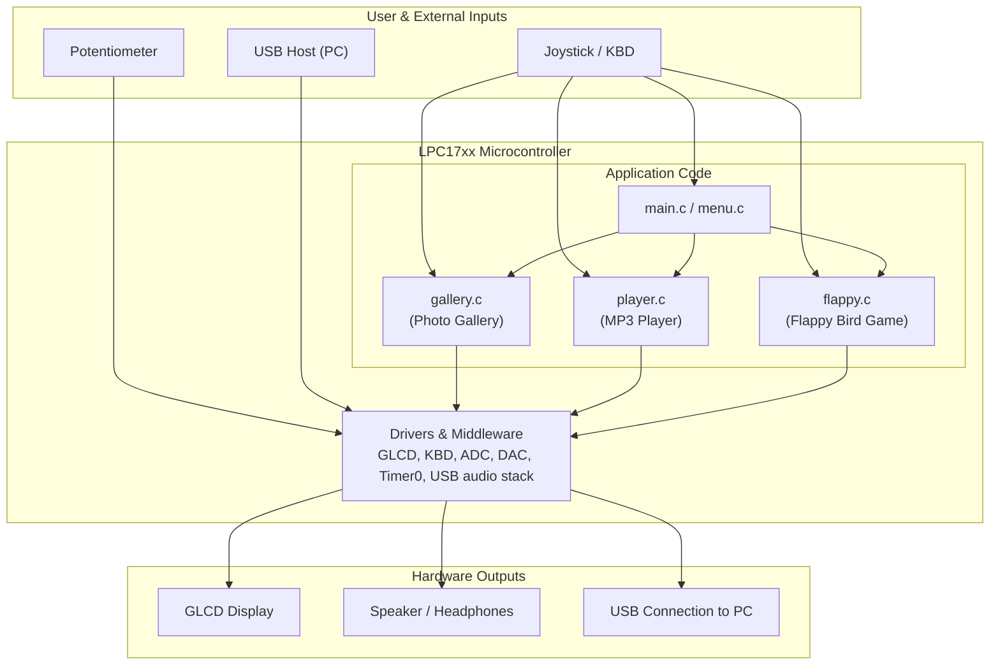

```mermaid
flowchart TB

  %% ========== INPUT SIDE ==========
  subgraph INPUTS["User & External Inputs"]
    KBD["Joystick / KBD"]
    POT["Potentiometer"]
    USB_HOST_IN["USB Host (PC)"]
  end

  %% ========== CORE MCU ==========
  subgraph CORE["LPC17xx Microcontroller"]
    
    subgraph APP["Application Code"]
      MAIN_MENU["main.c / menu.c"]
      GALLERY["gallery.c\n(Photo Gallery)"]
      PLAYER["player.c\n(MP3 Player)"]
      FLAPPY["flappy.c\n(Flappy Bird Game)"]
    end

    DRIVERS["Drivers & Middleware\nGLCD, KBD, ADC, DAC, Timer0, USB audio stack"]

  end

  %% ========== OUTPUT SIDE ==========
  subgraph OUTPUTS["Hardware Outputs"]
    GLCD["GLCD Display"]
    SPK["Speaker / Headphones"]
    USB_HOST_OUT["USB Connection to PC"]
  end

  %% ===== CONNECTIONS =====

  %% Inputs into core
  KBD --> MAIN_MENU
  KBD --> FLAPPY
  KBD --> GALLERY
  KBD --> PLAYER

  POT --> DRIVERS
  USB_HOST_IN --> DRIVERS

  %% App to drivers
  MAIN_MENU --> GALLERY
  MAIN_MENU --> PLAYER
  MAIN_MENU --> FLAPPY

  GALLERY --> DRIVERS
  PLAYER --> DRIVERS
  FLAPPY --> DRIVERS

  %% Drivers to outputs
  DRIVERS --> GLCD
  DRIVERS --> SPK
  DRIVERS --> USB_HOST_OUT

```
