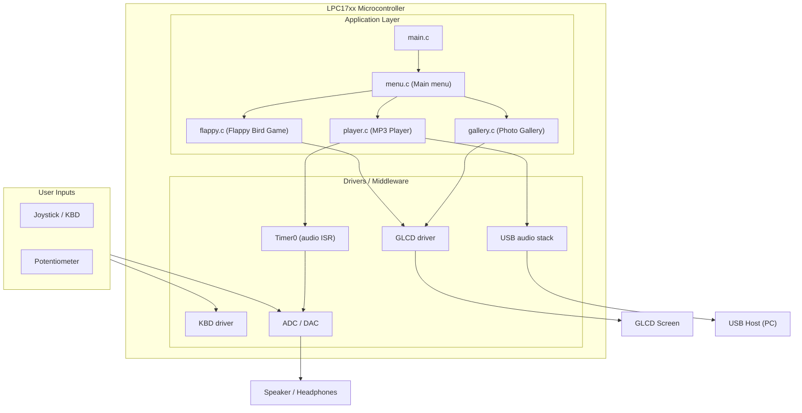

```mermaid
flowchart TD

  %% ==== USER INPUTS ====
  subgraph USER["User Inputs"]
    KBD_IN["Joystick / KBD"]
    POT_IN["Potentiometer"]
  end

  %% ==== MCU CORE ====
  subgraph MCU["LPC17xx Microcontroller"]
    
    %% Application layer
    subgraph APPS["Application Layer"]
      MAIN["main.c"]
      MENU["menu.c (Main menu)"]
      GALLERY["gallery.c (Photo Gallery)"]
      PLAYER["player.c (MP3 Player)"]
      FLAPPY["flappy.c (Flappy Bird Game)"]
    end

    %% Drivers & middleware
    subgraph DRV["Drivers / Middleware"]
      GLCD_DRV["GLCD driver"]
      KBD_DRV["KBD driver"]
      ADC_DAC["ADC / DAC"]
      TIMER0["Timer0 (audio ISR)"]
      USB_STACK["USB audio stack"]
    end

  end

  %% ==== HARDWARE OUTPUTS ====
  DISP["GLCD Screen"]
  USB_HOST["USB Host (PC)"]
  SPK["Speaker / Headphones"]

  %% ==== CONNECTIONS ====

  %% User inputs into MCU drivers
  USER --> KBD_DRV
  USER --> ADC_DAC

  %% Main flow
  MAIN --> MENU
  MENU --> GALLERY
  MENU --> PLAYER
  MENU --> FLAPPY

  %% Apps using drivers/middleware
  GALLERY --> GLCD_DRV
  FLAPPY --> GLCD_DRV

  PLAYER --> USB_STACK
  PLAYER --> TIMER0
  TIMER0 --> ADC_DAC

  %% Drivers to external hardware
  GLCD_DRV --> DISP
  USB_STACK --> USB_HOST
  ADC_DAC --> SPK
```